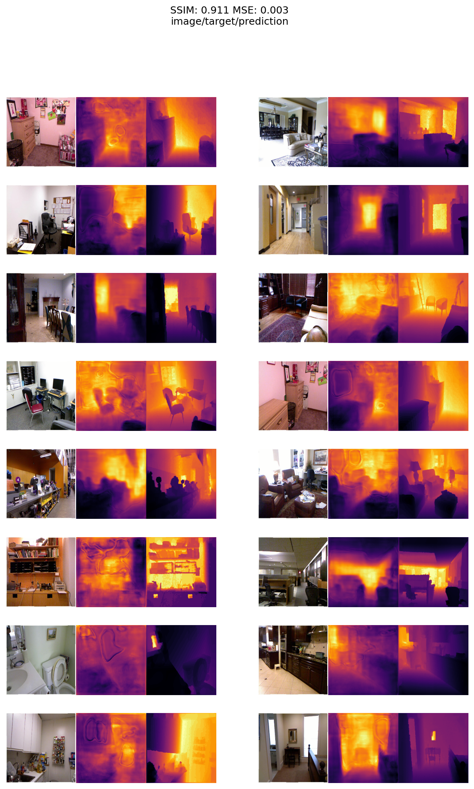

# Monocular Depth Estimation

- encoder model: resnext50 (Imagenet pretrained)
- decoder model: UNet++ ([PyTorch Segmentation Models](https://github.com/qubvel/segmentation_models.pytorch))
- dataset: [NYUv2 depth](https://cs.nyu.edu/~silberman/datasets/nyu_depth_v2.html)
- metrics: 
  - Structural Similarity Index Measure: SSIM is used for measuring the similarity between two images.
  - Mean Squared Error
  

## Results on test dataset:

- brighter the area, farther away it is in the image. brighter => more depth
- predicted depth maps are grayscale, a color gradient map is applied for visual purposes only.

